## Bill of Materials (BOM) — Analog-Whisker Micromouse

### 🗺️ Mind map

```
                          FRONT
   Whisker L  \       ___________      /  Whisker R
   AS5600 ──────●──[ pivot+magnet ]──●────── AS5600   (analog OUT)
                 |    3D CHASSIS     |
   Wheel L ◖━ N20+encoder ━━━━ N20+encoder ━◗ Wheel R
                 |  Teensy 4.0       |
                 |  MPU-6050 (mid)   |
                 |  LiPo 2S (bottom) |
                          REAR
                       (PTFE skid)
```

## 1. 🧠 Brain & power
- MCU: **Teensy 4.0** — ARM Cortex-M7 @ 600 MHz; **logic 3.3 V, NOT 5 V-tolerant**; powered via VIN 3.6–5.5 V; onboard 3.3 V LDO (~250 mA for peripherals); ADC + many PWM/timer pins. → reads the whiskers' analog OUT and generates the motor PWM.
- Battery: **LiPo 2S** — 7.4 V nominal (8.4 V full → ~6.0 V empty); choose **≥ 500 mAh, ≥ 20C** so it can supply the motor peaks (several A). This is the raw power rail. LiPo 2S 300-450 mAh / 20-30C (?)
- 5 V regulator: **MP1584** (buck) — input 4.5–28 V, **set output to 5 V**, up to ~3 A. Steps 7.4 V down to **5 V → Teensy VIN** (never feed 7.4 V directly to VIN).
- 3.3 V: Teensy onboard regulator — ~250 mA budget; powers **AS5600 ×2 + MPU-6050**; keep their total draw under that budget.
- Switch: slide switch — main cutoff on the battery **+** line; **rate it ≥ 3 A / ≥ 10 V** to survive motor stall current.
- Safety: fuse holder + **2 A** fuse (10 mm) — above the normal draw, below the wiring limit; blows on a short and protects the LiPo.

<table>
  <tr>
    <td align="center">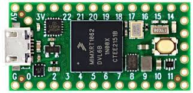<br>Teensy 4.0</td>
    <td align="center">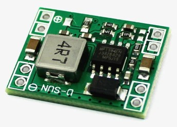<br>MP1584</td>
    <td align="center">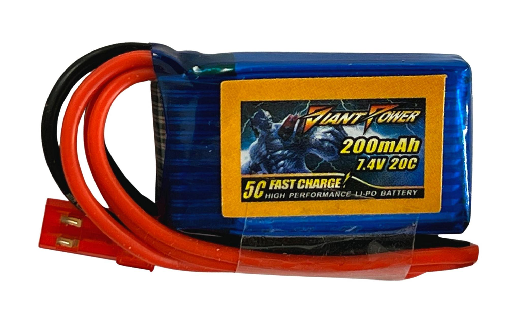<br>LiPo 2S</td>
    <td align="center">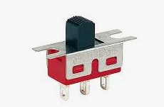<br>Slide switch</td>
    <td align="center">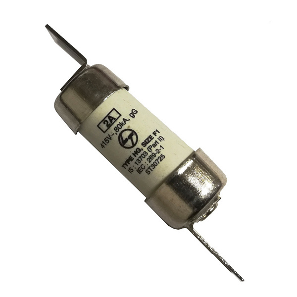<br>2 A fuse</td>
  </tr>
</table>

## 2. 🌊 Movement
- Motors ×2: **N20 6 V (~50–100:1) with integrated hall encoder** — running ~tens of mA, **stall ~0.7–1.5 A each**; encoder = 2-channel quadrature, 3.3 V-compatible. Driven from the 7.4 V rail but **PWM-limited so the average stays ≈ 6 V**.
- Driver: **TB6612FNG** — dual H-bridge; **VM (motor) 2.7–13.5 V** (from 7.4 V), **logic VCC 2.7–5.5 V → use 3.3 V from Teensy**; **1.2 A continuous / 3.2 A peak per channel** (matches the N20 pair). Control = 1 PWM + 2 direction pins per motor.
- Wheels ×2: **N20 Ø32 mm silicone** — circumference ≈ 100 mm; this diameter sets the **distance-per-encoder-tick** used for odometry.
- Rear support: **PTFE skid / ball caster** — frictionless 3rd contact; its height must match the wheel axis so the chassis sits level.

<table>
  <tr>
    <td align="center">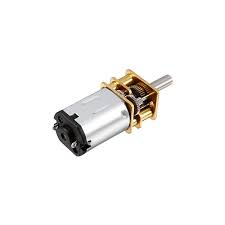<br>N20 motor</td>
    <td align="center">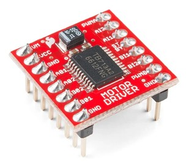<br>TB6612FNG</td>
    <td align="center">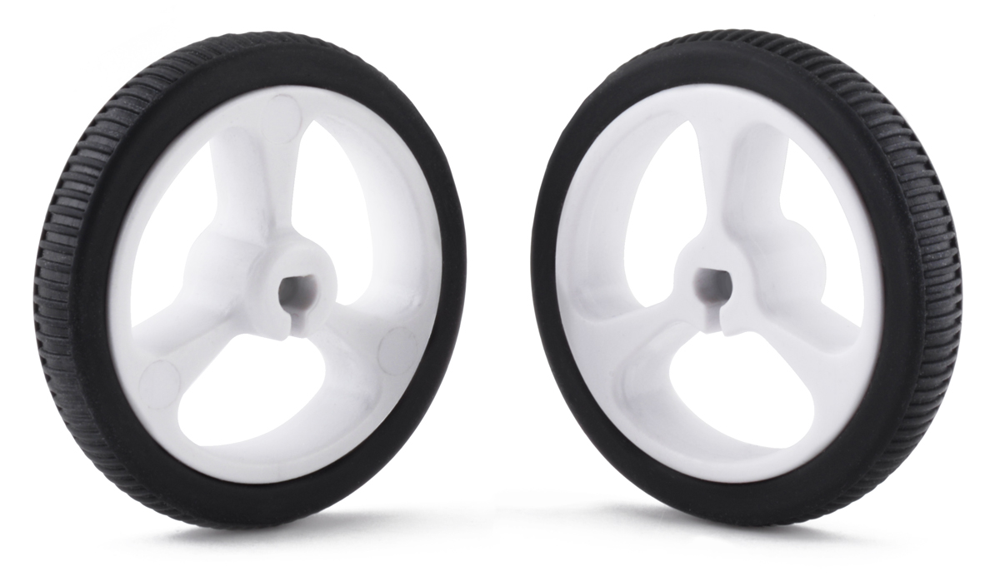<br>Wheels</td>
    <td align="center">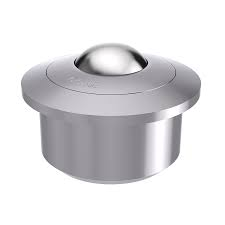<br>Ball caster</td>
  </tr>
</table>

## 3. 🧲 Analog whiskers (the core)
- Whisker sensor ×2: **AS5600 (module), analog OUT** — 12-bit magnetic angle sensor. ⚠️ **Power it at 3.3 V** so its ratiometric analog OUT stays **0–3.3 V = Teensy ADC range** (at 5 V it would output 0–5 V and damage the 3.3 V ADC). One ADC pin per whisker.
- Magnets ×2: **diametric Ø6 mm** — must be **diametrically** magnetized (not axially); mounted 0.5–3 mm above the AS5600 centre, on the pivot axis.
- Whisker rod: **carbon fiber Ø0.5 mm** (or piano wire) — stiff + light; transmits wall contact to the pivot/magnet.
- Pivot ×2: **MR63 bearing** — 3×6×2.5 mm; low friction so even tiny wall forces rotate the magnet cleanly.
- Damped return: micro-spring + rubber — gives a **centred rest position** and damps oscillation after contact.
- Low-friction tip: **PTFE sleeve / micro-ball** — slides along the wall without snagging.

<table>
  <tr>
    <td align="center">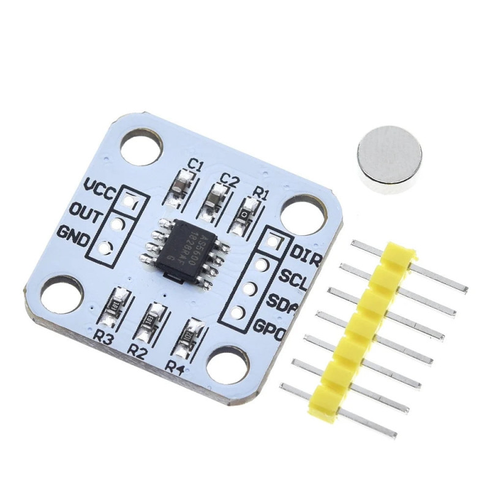<br>AS5600</td>
    <td align="center">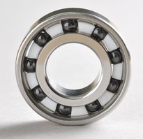<br>MR63 bearing</td>
    <td align="center">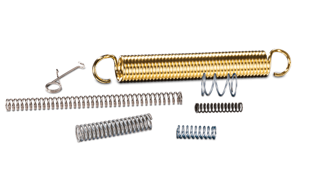<br>Micro-spring</td>
    <td align="center"><br>Micro-ball</td>
  </tr>
</table>

## 4. 🧭 Inertial sensing
- Wheel encoders: **integrated in the N20 motors** — quadrature; primary odometry (distance travelled + speed).
- IMU: **MPU-6050 (GY-521)** — 6-axis (gyro + accel), **I2C** (addr 0x68); **feed 3.3 V to match Teensy logic**. The gyro Z axis gives heading correction during turns.

<table>
  <tr>
    <td align="center">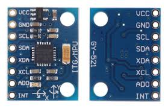<br>MPU-6050</td>
  </tr>
</table>

## 5. 🫧 Clean signal chain (motor-noise)
- Reservoir capacitor: **≥ 470 µF** electrolytic — **rated ≥ 16 V**; across VM near the driver to absorb motor current spikes (prevents brown-out resets of the Teensy).
- RC filter ×2: **R 1 kΩ + C 100 nF** per whisker — low-pass on each analog line; **fc = 1/(2πRC) ≈ 1.6 kHz** → removes motor PWM noise while passing the slow whisker signal.
- Decoupling: **100 nF** per chip — placed close to each IC's VDD/GND pins.
- Star ground (wiring) — one single common ground point so motor return currents don't pollute the sensor ground.

<table>
  <tr>
    <td align="center">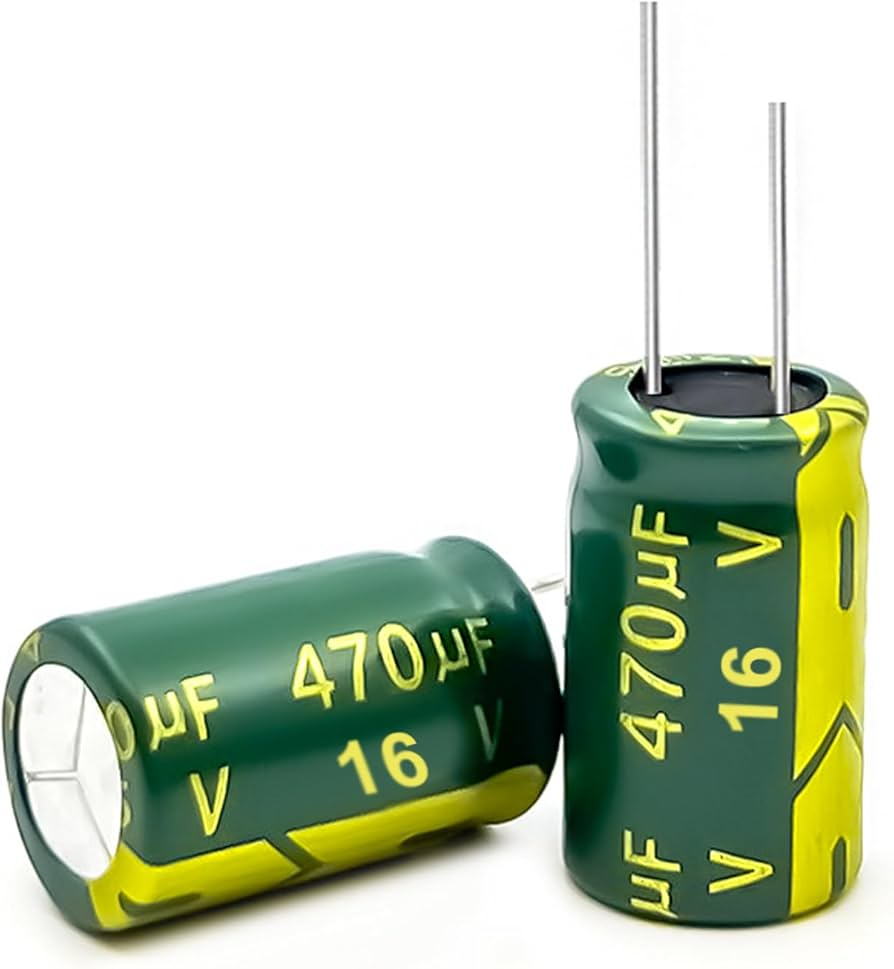<br>470 µF cap</td>
    <td align="center">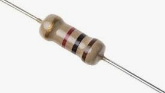<br>RC filter</td>
    <td align="center">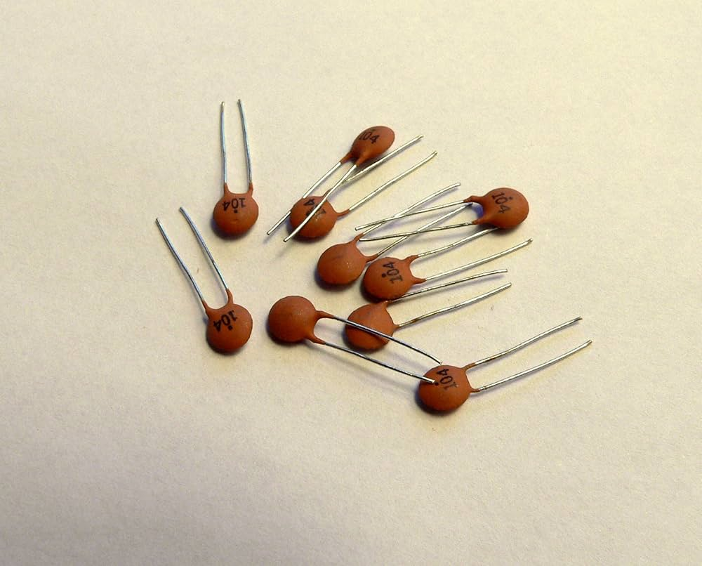<br>Decoupling</td>
  </tr>
</table>

## 6. 🏠 Chassis & mechanics
- Chassis: **3D-printed PLA** (oval) + perfboard/Dupont — keep the mass low for sharp accel/braking.
- Motor brackets ×2: 3D-printed — must hold the two N20 axes **parallel and at the same height** → straight tracking.
- Screws: **M2** + nylon nuts — standard for N20/PLA; nylon (nyloc) nuts resist vibration loosening.
- Whisker module ×2: 3D-printed (base plate + arm) — carries the AS5600 + pivot + magnet assembly.
- Wiring: Dupont + perfboard — keep motor wires away from / twisted vs. sensor wires to limit coupled noise.

---

## ⚡ Coherence check (does it all fit together?)

**Power chain:** `LiPo 7.4 V` → motors (via TB6612FNG VM) **and** → `MP1584` → `5 V` → Teensy VIN → onboard `3.3 V` → AS5600 ×2 + MPU-6050.

| Rail | Source | Feeds | Watch out |
|---|---|---|---|
| 7.4 V | LiPo | motors (VM), MP1584 in | switch + fuse must take the motor peaks |
| 5 V | MP1584 | Teensy VIN | set the buck to 5 V, ≥ 1 A |
| 3.3 V | Teensy LDO | AS5600 ×2, MPU-6050 | stay under ~250 mA total |

**Logic levels:** everything talks **3.3 V** — Teensy (not 5 V-tolerant), TB6612FNG logic (fed 3.3 V), encoders, AS5600 analog OUT (0–3.3 V), MPU-6050 I2C (3.3 V). No level shifter needed.

**Current budget:** continuous draw is small (logic + sensors ≈ <0.3 A); the design driver is the **motor stall/peak current (~1–3 A total)** → that sets the battery C-rating, the switch rating, the 2 A fuse and the ≥ 470 µF reservoir cap.


## 🖨️ Parts to 3D-print (status)

<table>
  <tr>
    <td width="62%" align="center" valign="top">
      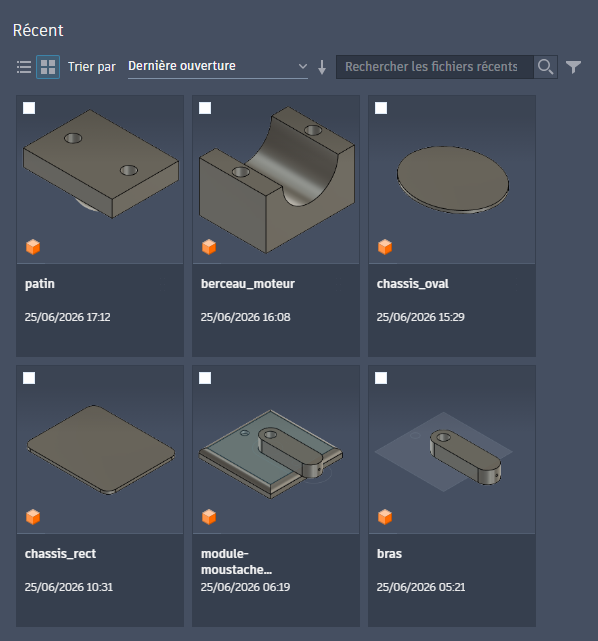
    </td>
    <td width="38%" valign="top">
      <table>
        <tr><th>#</th><th>Part</th><th>Status</th></tr>
        <tr><td>1</td><td>Base plate</td><td>✅</td></tr>
        <tr><td>2</td><td>Whisker arm</td><td>✅</td></tr>
        <tr><td>3</td><td>Oval chassis</td><td>✅</td></tr>
        <tr><td>4</td><td>Motor brackets ×2</td><td>✅</td></tr>
        <tr><td>5</td><td>Rear skid</td><td>✅</td></tr>
      </table>
    </td>
  </tr>
</table>


## 🛠️ Tools / software / languages

**Software**
- Fusion 360 — CAD (3D parts)
- mms — maze algorithm simulator
- Arduino / PlatformIO — firmware (Teensy)
- Python — signal analysis & telemetry (also 2D sim for control logic)

**Languages**
- C++ — firmware + mms
- Python — signal modeling / analysis

**Hardware tools**
- 3D printer
- soldering iron
- multimeter
- bench power supply
- (oscilloscope / logic analyzer — ideal)